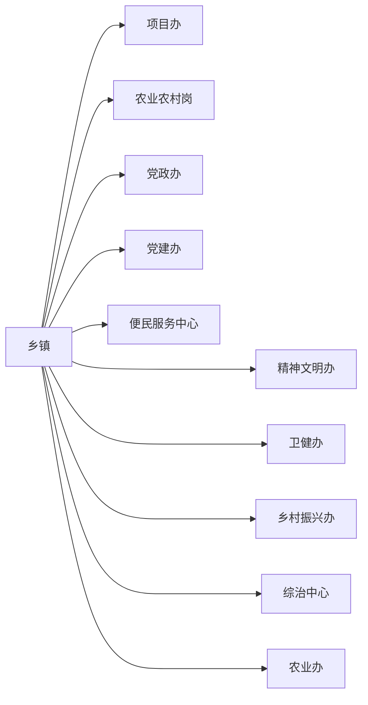
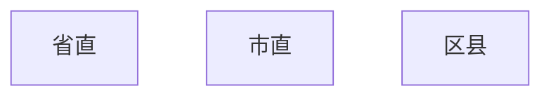

## 常见问题 ##

```mermaid
graph LR

D[乡镇]
D[乡镇]-->D1[项目办]	
D[乡镇]-->D2[农业农村岗]
D[乡镇]-->D3[党政办]
D[乡镇]-->D4[党建办]
D[乡镇]--->D5[精神文明办]
D[乡镇]--->D6[卫健办]
D[乡镇]--->D7[乡村振兴办]
D[乡镇]--->D8[综治中心]
D[乡镇]--->D9[农业办]
D[乡镇]-->D10[便民服务中心]
click D href "./xiangzhen/" _blank
```

```mermaid
graph TB
A[省直]
click A href "./shengzhi" _blank
B[市直]
click A href "./shizhi" _blank
C[区县]
click A href "./quxian" _blank
```