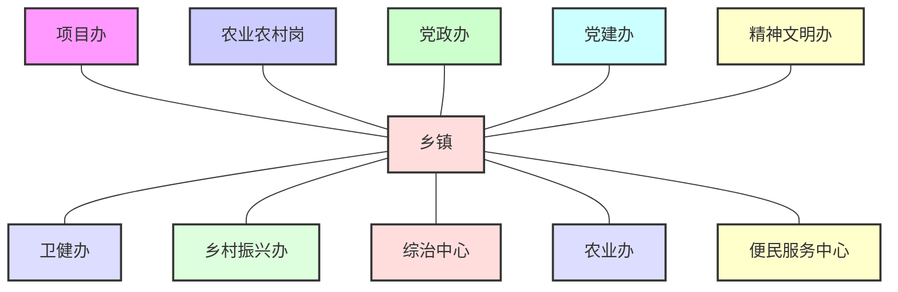
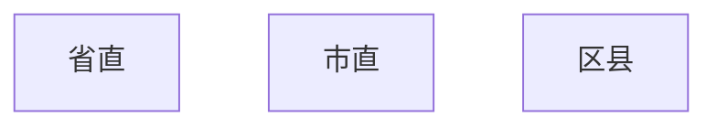

## 常见问题 ##

```mermaid
graph TB

 	style D1 fill:#f9f,stroke:#333,stroke-width:2px
    style D2 fill:#ccf,stroke:#333,stroke-width:2px
    style D3 fill:#cfc,stroke:#333,stroke-width:2px
    style D4 fill:#cff,stroke:#333,stroke-width:2px
    style D5 fill:#ffc,stroke:#333,stroke-width:2px
    style D fill:#fdd,stroke:#333,stroke-width:2px
    style D6 fill:#ddf,stroke:#333,stroke-width:2px
    style D7 fill:#dfd,stroke:#333,stroke-width:2px
    style D8 fill:#fdd,stroke:#333,stroke-width:2px
    style D9 fill:#ddf,stroke:#333,stroke-width:2px
    style D10 fill:#ffc,stroke:#333,stroke-width:2px
    
    click D1 href "xiangzhen/xiangzhenban/" _blank
    click D2 href "xiangzhen/nongyerenchengang/" _blank
    click D3 href "xiangzhen/dangzhengban/" _blank
    click D4 href "xiangzhen/dangjianban/" _blank
    click D5 href "xiangzhen/jingshenwenmingban/" _blank
    click D href "xiangzhen/" _blank
    
    click D6 href "xiangzhen/weijanban/" _blank
    click D7 href "xiangzhen/xiangcunzhenxingban/" _blank
    click D8 href "xiangzhen/zongzhi/" _blank
    click D9 href "xiangzhen/nongyeban/" _blank
    click D10 href "xiangzhen/bianminfuwuzhongxin/" _blank
   
    D1[项目办] --- D[乡镇]
    D2[农业农村岗] --- D[乡镇]
    D3[党政办] --- D[乡镇]
    D4[党建办] --- D[乡镇]
    D5[精神文明办] --- D[乡镇]
    D[乡镇] --- D6[卫健办]
    D[乡镇] --- D7[乡村振兴办]
    D[乡镇] --- D8[综治中心]
    D[乡镇] --- D9[农业办]
    D[乡镇] --- D10[便民服务中心]

```

```mermaid
graph TB
A[省直]
click A href "./shengzhi" _blank
B[市直]
click A href "./shizhi" _blank
C[区县]
click A href "./quxian" _blank
```